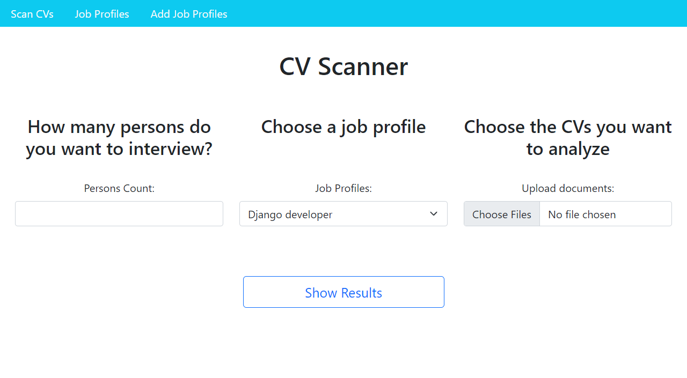
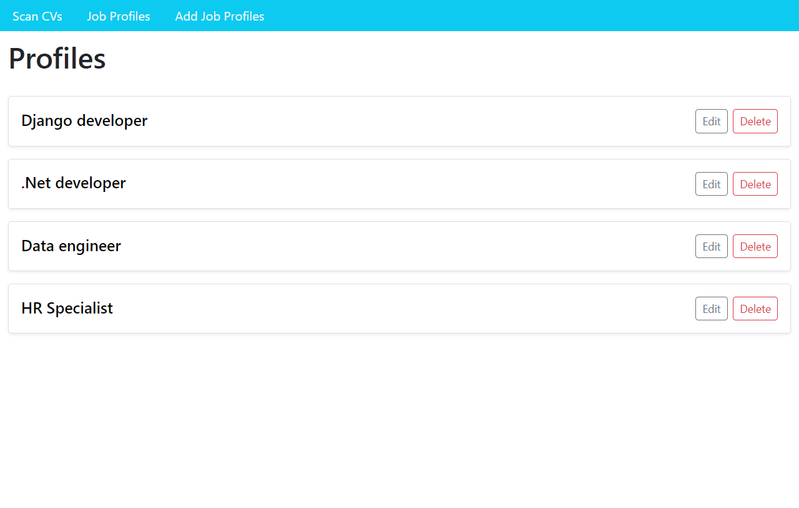
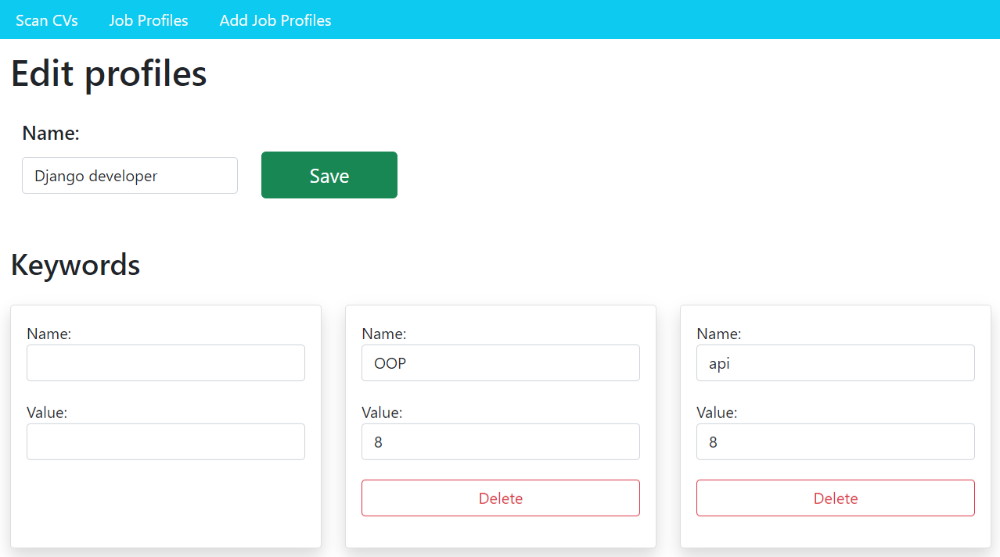
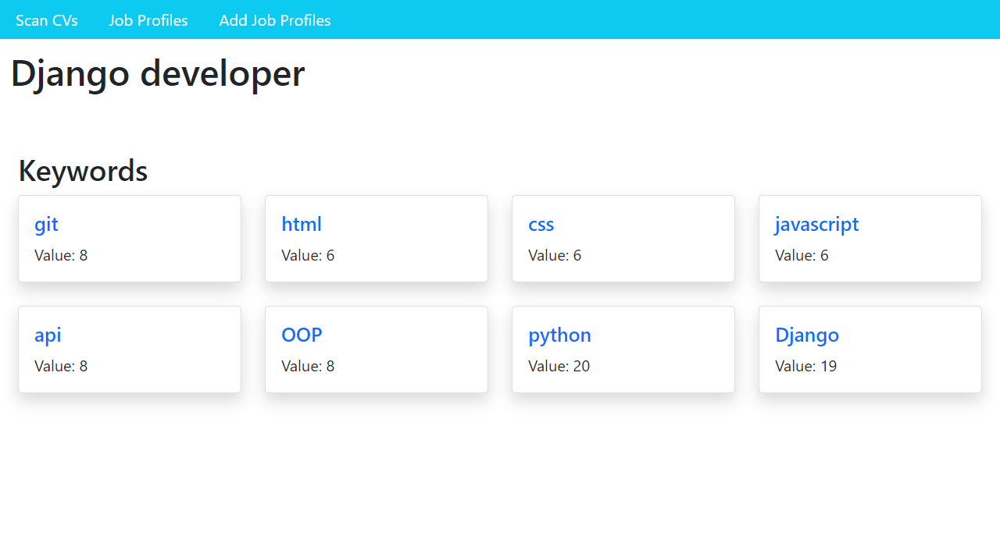
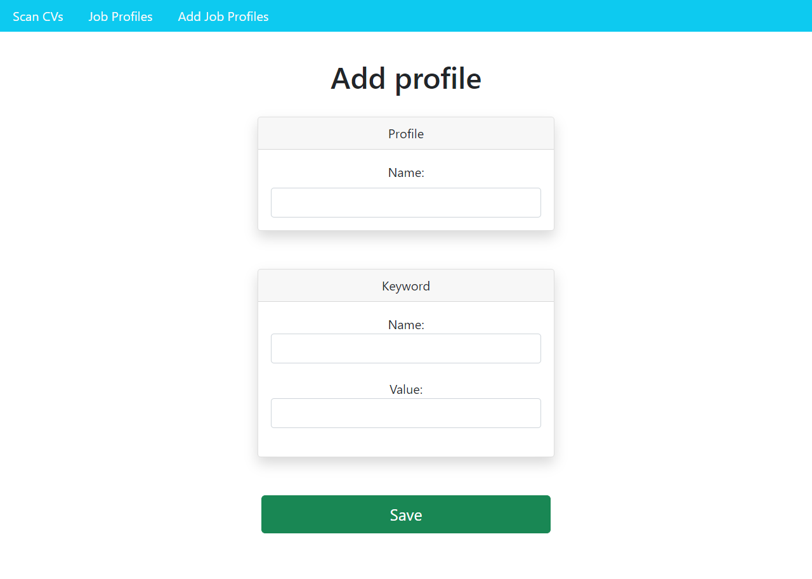
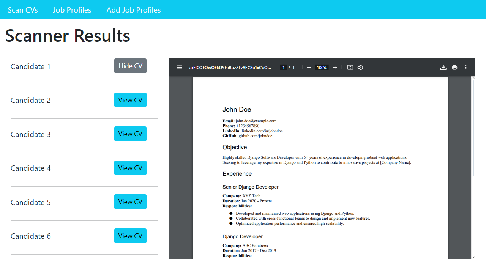

# CV-Scanner

[](https://www.djangoproject.com/)
[](https://www.python.org/)
[](https://www.postgresql.org/)
[](https://getbootstrap.com/)
[](https://www.docker.com/)

## Overview

**CV-Scanner** is a Django-based web application designed to streamline the process of scanning and analyzing resumes. The application utilizes PostgreSQL for data management and is containerized using Docker for easy deployment. The frontend is built with HTML, CSS, JavaScript and Bootstrap to provide a responsive and user-friendly interface.



- [Project Features](#project-features)
- [Technologies Used](#technologies-used)
- [Prerequisites](#prerequisites)
- [Steps for Setting Up the Project Locally](#steps-for-setting-up-the-project-locally)
    - [Create virtual environment](#create-virtual-environment)
    - [Activate virtual environment](#activate-virtual-environment)
    - [Install the required packages](#install-the-required-packages)
    - [Add environment variables](#add-environment-variables)
    - [Apply the migrations](#apply-the-migrations)
    - [Run Django project](#run-django-project)
- [Steps for Setting Up the Project Using Docker](#steps-for-setting-up-the-project-using-docker)
    - [Build the docker images and run the containers](#build-the-docker-images-and-run-the-containers)
- [Running Tests](#running-tests)
- [Usage](#usage)

## Project Features

- **Job Profile Management:**
  - **View All Job Profiles**: Navigate to a page listing all saved job profiles from the database. Each profile includes options to edit or delete.
    
  - **Edit Job Profile**: Click the "Edit" button next to each job profile to modify its details.
    
  - **View Job Profile Details**: Access the detailed view of a job profile, showing all associated keywords and information, by clicking the job profile title.
    
  - **Add New Job Profile**: Use a dedicated page to create and save a new job profile to the database.
     

- **Home Page Functionalities:**
  - **Candidate Selection**: Specify the number of candidates you'd like to interview.
  - **Profile-Based Filtration**: Select a job profile to automatically filter candidates based on the role's requirements.
  - **Resume Upload**: Easily upload resumes from your local machine for analysis.
  - **Results Display**:
    - **Top Candidates**: Automatically generate a list of the top candidates.
    - **CV Viewer**: Directly view the CVs of selected candidates within the application.
    

## Technologies Used

- **Backend:** Django, Python
- **Database:** PostgreSQL
- **Frontend:** HTML, CSS, JavaScript, Bootstrap
- **Containerization:** Docker, Docker Compose

## Prerequisites

To run the project locally (without Docker), you need:

- **Python 3.8+**: Ensure you have Python 3.8 or higher installed.
- **PostgreSQL 12.0+**: PostgreSQL is required if you are deploying the application locally. You can use PostgreSQL 12.0 or later versions.

## Steps for setting up the project locally

### Create virtual environment
```bash
python -m venv .venv
```

### Activate virtual environment
```bash
source .venv/Scripts/activate
```

### Install the required packages
```bash
pip install -r requirements.txt
```

### Add environment variables
In the root directory, create a file called *.env*.
Declare your environment variables in *.env*. Use them to make a connection with an already existing PostgreSQL database.
```
SECRET_KEY=your_secret_key
DEBUG=True
ALLOWED_HOST=localhost, 127.0.0.1
POSTGRES_DB=your_db_name
POSTGRES_USER=your_db_user
POSTGRES_PASSWORD=your_db_password
POSTGRES_HOST=localhost
POSTGRES_PORT=5432
```

### Apply the migrations
```bash
py manage.py migrate
```

### Run Django project
```bash
py manage.py runserver
```

## Steps for setting up the project using docker

### Build the docker images and run the containers
```bash
docker-compose up --build
```

## Running Tests

```bash
python manage.py test
```

## Usage

Once the project is running, you can access the application in your web browser at `http://localhost:8000/`. Here’s how you can use the main features:

1. **Manage Job Profiles**:
   - **View All Profiles**: Go to the "Job Profiles" page to see a list of all job profiles. Each profile has options to **edit** or **delete**.
   - **Edit a Profile**: Click the "Edit" button next to each profile to update its details. You’ll be directed to the job profile page where you can modify information.
   - **Delete a Profile**: Click the "Delete" button to remove the job profile from the database.
   - **View Job Profile Details**: Click on the job profile title to see its detailed view, including all associated keywords.
   - **Add a New Job Profile**: Use the "Add Job Profiles" page to create a new profile. Fill in the necessary fields and save it to the database.

2. **Filter Candidates on the Home Page**:
   - On the homepage, start by **entering the number of candidates** you wish to interview.
   - **Select a job profile** from the dropdown menu to set the criteria for candidate selection.
   - **Upload resumes** from your computer by clicking the "Choose Files" button.
   - Click **"Show Results"** to generate a list of the top candidates based on the selected job profile.
   - For more details, click **"View CV"** button next to a candidate to see their full resume directly on the page.